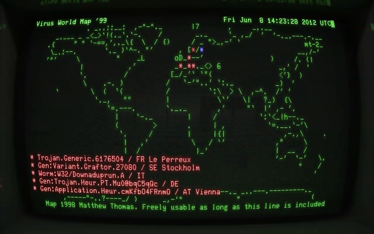

F-Secure Virus World Map console version
========================================

Copyright 2012-2013 Jyrki Muukkonen

Released under the MIT license.
See LICENSE.txt or http://www.opensource.org/licenses/mit-license.php

ASCII map in map-world-01.txt is copyright:
 "Map 1998 Matthew Thomas. Freely usable as long as this line is included"

Based on (semi)public F-Secure Virus World Map 3 JSON feed.

This small piece of software was originally done only for demonstrating
how the data could be used. There are no guarantees whatsoever that
the live stream stays accessible nor that the information is accurate
in any way.

Usage
-----

Usually just:

```
./wm3con.py
```

In case of encoding / curses bugs:

```
LC_CTYPE=C ./wm3con.py
```


Cool ways to use this
---------------------

* Live bootable ISO / USB image. Proof of concept using [Debian Live](http://live.debian.net/devel/live-build/) exists. Generally automatic network works, but there are some issues with live-build itself and with various screen configurations.
* Running inside [Cathode Vintage Terminal](http://www.secretgeometry.com/apps/cathode/) app on OSX. There might be some videos in the internets.
* Running with a real VT100 or something :)
* Instructions and/or videos for these might appear here later
* Lab screen [running the live version](http://www.youtube.com/watch?v=t_8_tgR0Nc4)

Screenshots
-----------



Notes / TODO
------------

- it will crash if you resize your terminal to be too small
- map zoom levels could be supported, but then the coordinate calc logic needs some modifications (now it assumes that whole world is visible)
- there are some drawing bugs on unicode location names, even with libncursesw
- should use optparse/argparse/argh for parameter parsing


